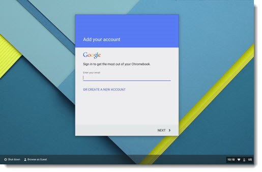

  

As an assisstant tech coordinator for a high school, one of my most common tasks were unboxing, setting up, and assembling Chromebook labs. Amoung other things, each Chromebook had to be properly be signed in to the school email, as well as connected to the school wifi. With almost one thousand Chromebooks to set up, this process would usally take a full day per lab. To help with this, we used a USB Arduino to send all the keystrokes needed into the Chromebook. This not only included the text for usernames and passwords, but also the tab keys needed to switch to different text fields, enter keys to get to other screens, and even pauses in the text sending timed to the average wait of each loading screen. With multiple Arduino devices the initialization time was cut by almost a third.

